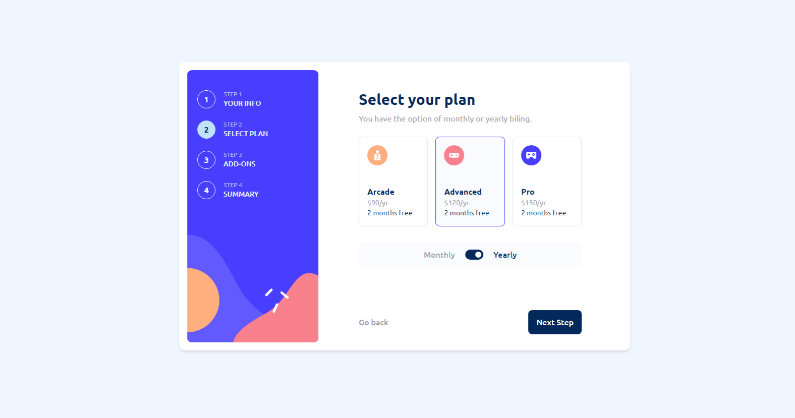

# Frontend Mentor - Multi-step form 💻

Esta é uma solução para o [Multi-step form challenge on Frontend Mentor](https://www.frontendmentor.io/challenges/multistep-form-YVAnSdqQBJ).

### O Desafio :book:

os usuários devem ser capazes de:

- Concluir cada etapa da sequência
- Voltar para uma etapa anterior para atualizar suas seleções
- Ver um resumo de suas seleções na etapa final e confirme seu pedido
- Visualizar o layout ideal para a interface, dependendo do tamanho da tela do dispositivo
- Ver os estados de foco de todos os elementos interativos da página
- Receber uma mensagem de validação caso:
  - Algum campo estiver em branco
  - O endereço de email não estiver formatado corretamente

### Links

- Solution URL: [https://github.com/gbmouraa/multi_step_form](https://github.com/gbmouraa/multi_step_form)
- Live Site URL: [https://gmoura-multi-step-form.netlify.app/](https://gmoura-multi-step-form.netlify.app/)

### Tecnologias utilizadas :rocket:

- **React** - Biblioteca JS
- **Tailwind** - Framework CSS
- **Context API** - Para gerenciamento de estados

## Author

- Website - [Gabriel Moura](https://gmouradev.netlify.app/)
- Frontend Mentor - [@gbmouraa](https://www.frontendmentor.io/profile/gbmouraa)
- Linkedin - [Gabriel Moura](https://www.linkedin.com/in/gabriel-moura-b63382161/)
